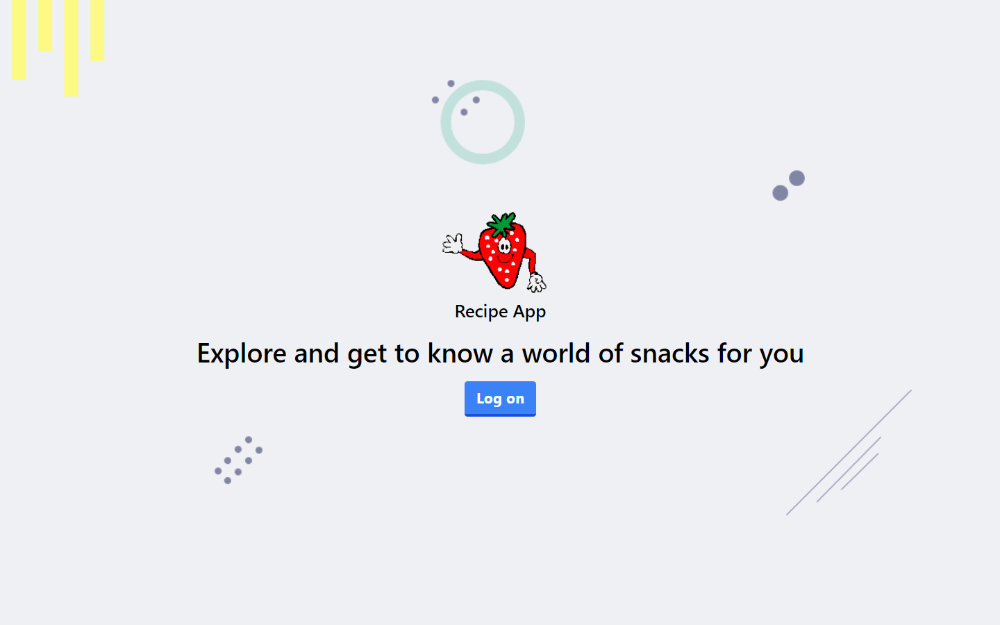
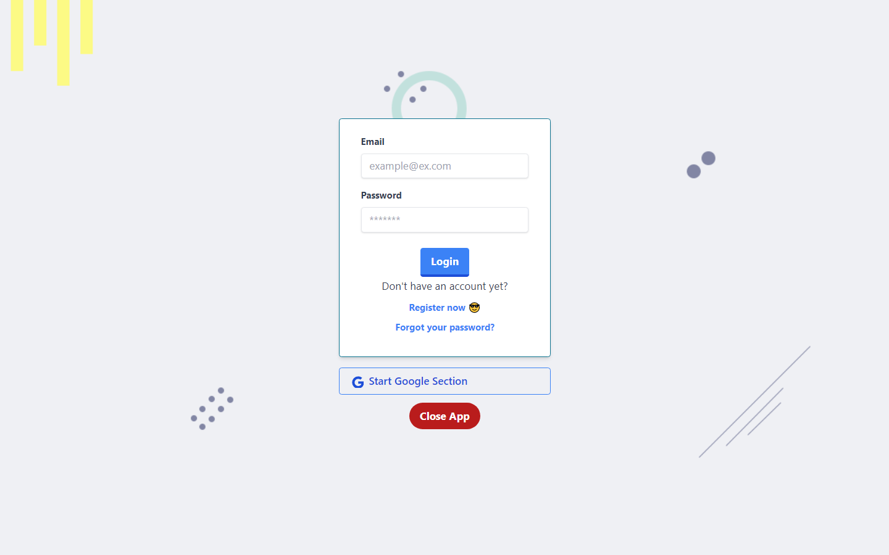
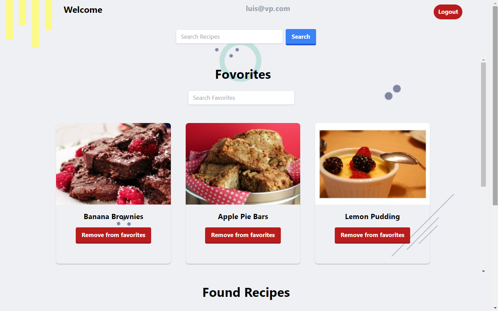
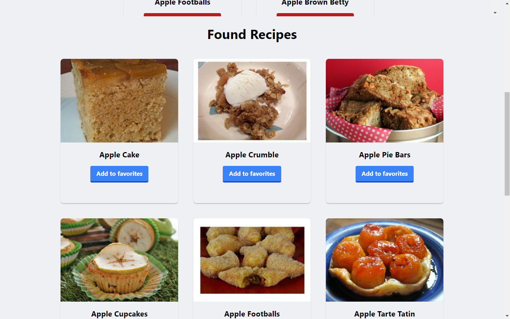
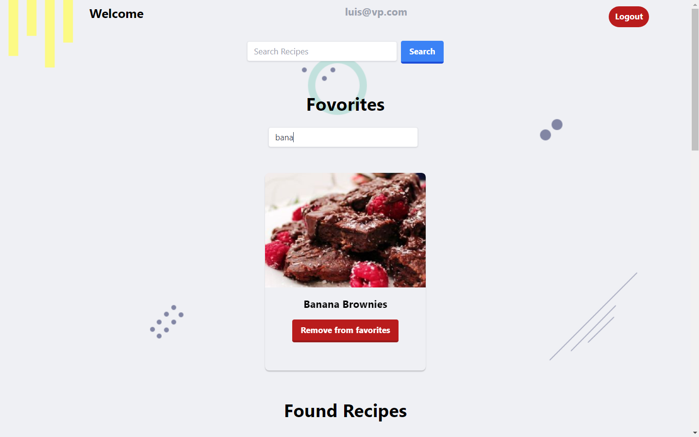
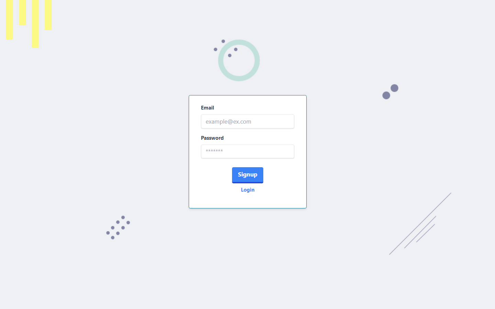

# App de Receta

### Welcome

### Login

### Home

### Found Recipes

### Search Favorites Items

### Signup

## Descripción

Esta aplicación ha sido desarrollada con fines educativos en el marco del curso de programación web, y ha sido aprobada como proyecto final del curso. Implementada con React, esta herramienta permite a los usuarios registrarse utilizando una dirección de correo electrónico o su cuenta de Google, brindándoles la capacidad de buscar y guardar recetas sencillas.

El sistema de autenticación de usuarios incluido en la aplicación cumple con las validaciones necesarias para garantizar el cumplimiento de los requisitos establecidos antes de permitir el acceso a la página principal. En esta sección, los usuarios tienen la oportunidad de explorar, buscar y descubrir recetas, condimentos y frutas. La aplicación mostrará sugerencias de recetas disponibles en la API que coincidan con la búsqueda realizada por el usuario.

#### Fraimer Aquiles Carrasco Santana
